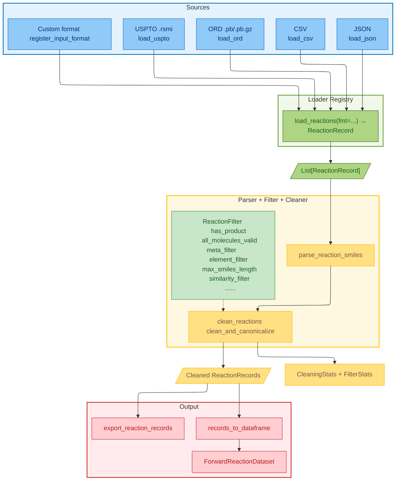

# chemrxn-cleaner

Lightweight helpers for parsing, cleaning, filtering, reporting, and exporting organic reaction datasets before ML or analytics workflows.

## Design




## Installation

- Python 3.9+ with RDKit available (platform-specific wheels are not bundled).
- The package depends on `ord-schema`, `pandas`, `tqdm`, and `torch` (for the ML helpers).

```bash
pip install chemrxn-cleaner
```

Developing locally? Install in editable mode:

```bash
pip install -e .
```

## Quick start

```python
from chemrxn_cleaner import (
    clean_and_canonicalize,
    clean_reactions_with_report,
    default_filters,
    export_reaction_records,
    load_reactions,
)

raw = load_reactions("data/sample.rsmi", fmt="uspto", keep_meta=True)
filters = default_filters()

cleaned = clean_and_canonicalize(raw, filters=filters)
print(f"Kept {len(cleaned)}/{len(raw)} reactions after cleaning")

# Need per-filter stats? Call the reporting variant instead:
cleaned_with_report, stats = clean_reactions_with_report(raw, filters=filters)
print(f"Failed parses: {stats.n_failed_parse}, dropped: {stats.n_input - stats.n_output}")

export_reaction_records(cleaned, "cleaned.json", fmt="json")
export_reaction_records(cleaned, "cleaned.csv", fmt="csv")
```

## Loading reaction data

Use the registry-driven `load_reactions(..., fmt=...)` helper or call the individual loaders directly. Built-in formats are auto-registered when the package is imported.

- **USPTO .rsmi** (optionally keep tab-separated metadata in `extra_metadata["fields"]`):

  ```python
  from chemrxn_cleaner import load_reactions

  uspto_rxns = load_reactions("data/uspto_sample.rsmi", fmt="uspto", keep_meta=True)
  ```

- **ORD .pb/.pb.gz** (populates `reaction_id`, basic conditions, yields, and `extra_metadata["reaction_index"]`):

  ```python
  ord_rxns = load_reactions(
      "data/ord_dataset.pb.gz",
      fmt="ord",
      generate_if_missing=True,
      allow_incomplete=True,
      canonical=True,
  )
  ```

- **CSV** (either assemble reaction SMILES from columns or read a pre-built column). The optional `mapper(record, row)` can enrich or skip rows by returning `None`.

  ```python
  from chemrxn_cleaner import load_reactions
  from chemrxn_cleaner.types import ReactionRecord

  csv_rxns = load_reactions(
      "data/reactions.csv",
      fmt="csv",
      reactant_columns=["reactant_a", "reactant_b"],
      reagent_columns=["catalyst"],
      product_columns=["product"],
      mapper=lambda record, row: (
          record.extra_metadata.update({"temperature": row.get("temp_c")}) or record
      ),
  )

  csv_rxns_prebuilt = load_reactions(
      "data/reactions.csv",
      fmt="csv",
      reaction_smiles_column="rxn_smiles",
  )
  ```

- **JSON** (supply a mapper per entry):

  ```python
  from chemrxn_cleaner import load_reactions
  from chemrxn_cleaner.parser import parse_reaction_smiles

  def map_json_entry(item):
      rec = parse_reaction_smiles(f"{item['reactants']}>>{item['products']}", strict=False)
      rec.source = "json"
      rec.extra_metadata.update(item.get("meta", {}))
      return rec

  json_rxns = load_reactions("data/reactions.json", fmt="json", mapper=map_json_entry)
  ```

- **Custom formats**: Register your own loader and call it through the registry.

  ```python
  from chemrxn_cleaner import load_reactions, register_input_format
  from chemrxn_cleaner.types import ReactionRecord

  def load_my_format(path: str):
      rec = ReactionRecord(reaction_smiles="A>B>C", source="myfmt")
      return [rec]

  register_input_format("myfmt", load_my_format)
  rxns = load_reactions("my_file.txt", fmt="myfmt")
  ```

## Cleaning and filters

`clean_reactions` parses missing reactant/reagent/product lists, applies filters, and optionally drops failed parses. `clean_and_canonicalize` also canonicalizes every SMILES; call it with `filters=default_filters()` for the default stack (`has_product`, `all_molecules_valid`, strict parsing, isomeric SMILES).

```python
from chemrxn_cleaner import (
    clean_and_canonicalize,
    clean_reactions_with_report,
    default_filters,
    max_smiles_length,
)
from chemrxn_cleaner.filters import ElementFilterRule, element_filter, meta_filter
from chemrxn_cleaner.utils import similarity_filter

filters = default_filters() + [
    max_smiles_length(250),
    element_filter(
        forbidList=ElementFilterRule([], ["Cl"], []),
    ),
    meta_filter(lambda meta: meta.get("source") == "trusted"),
    similarity_filter("c1ccccc1", role="reactant", threshold=0.6),
]

cleaned = clean_and_canonicalize(
    rxn_smiles_list=uspto_rxns,
    filters=filters,
    isomeric=True,
)

# Get a per-filter report alongside the cleaned list
cleaned, stats = clean_reactions_with_report(uspto_rxns, filters=filters)
```

Filters are simple callables returning `True`/`False`. Compose `meta_filter`, `element_filter`, `max_smiles_length`, `similarity_filter`, or author your own to encode domain rules.

## Reporting and exporting

Use `clean_reactions_with_report` to capture filter-level counters, failed parse counts, and the final number of reactions kept.

```python
from chemrxn_cleaner import clean_reactions_with_report, export_reaction_records

cleaned, stats = clean_reactions_with_report(raw, filters=filters)
print(f"Input: {stats.n_input}, output: {stats.n_output}, failed_parse: {stats.n_failed_parse}")
for name, fstats in stats.per_filter.items():
    print(f"{name}: applied={fstats.applied}, passed={fstats.passed}, failed={fstats.failed}")

export_reaction_records(cleaned, "cleaned.json", fmt="json")
export_reaction_records(cleaned, "cleaned.csv", fmt="csv")

# Combine stats from parallel cleaning runs
from chemrxn_cleaner.reporter import CleaningStats

combined_stats = CleaningStats.combine([stats_worker_1, stats_worker_2, stats_worker_3])
print(combined_stats.n_input, combined_stats.n_output)
```

## Working with `ReactionRecord`

`ReactionRecord` stores the parsed reaction (`reaction_smiles`, `reactants`, `reagents`, `products`) plus identifiers (`reaction_id`, `source`, `source_ref`, `source_file_path`), optional conditions (`temperature_c`, `time_hours`, `pressure_bar`, `ph`, `solvents`, `catalysts`, `bases`, `additives`, `atmosphere`, `scale_mmol`), yields (`yield_value`, `yield_type`), success/selectivity flags, and arbitrary `extra_metadata`. Use `to_dict()`/`from_dict()` for serialization, and `show()` to render a reaction image when RDKit visualization is available.

## ML utilities

- `records_to_dataframe` converts ReactionRecords to a pandas DataFrame for quick EDA/export.
- `train_valid_test_split` produces a deterministic random split.
- `ForwardReactionDataset` is a minimal PyTorch `Dataset` for forward prediction; each record should expose `reactant_smiles`, `reagent_smiles`, and `product_smiles` attributes if you plan to use it with a model.

```python
from chemrxn_cleaner import ForwardReactionDataset, records_to_dataframe, train_valid_test_split

df = records_to_dataframe(cleaned)
train, valid, test = train_valid_test_split(cleaned, seed=123)

for r in cleaned:
    r.reactant_smiles = r.reactants
    r.reagent_smiles = r.reagents
    r.product_smiles = r.products

dataset = ForwardReactionDataset(train, use_agents=True)
example = dataset[0]
```

## Examples

An interactive walkthrough lives at `examples/example.ipynb`. It demonstrates loading ORD, USPTO, JSON, and CSV datasets, applying filter stacks (including similarity filtering), and exporting cleaned reactions. Open it in Jupyter and swap in your own file paths to mirror the workflows.
